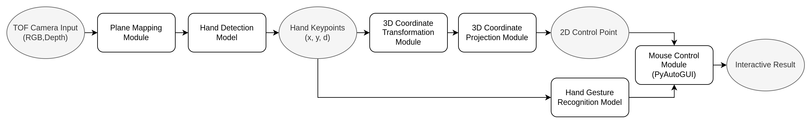
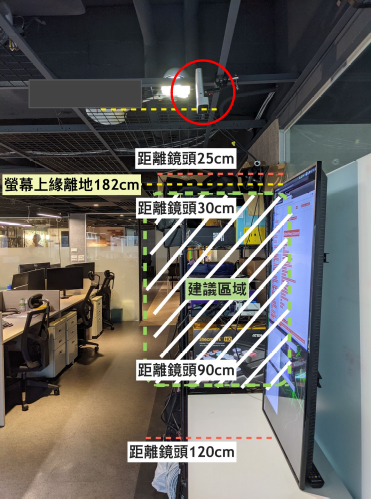
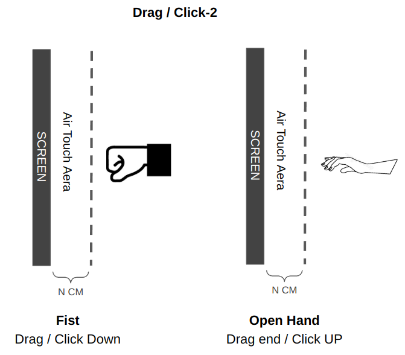

# Touchless Control System
Azure Kinect Real-Time Touchless Control System on Jetson Edge Device

## Festures
- Edge Computing (Nvidia Jetson Devices)
- Real-time control response (FPS 25~)
- Integrate to any device with mouse control easily


## Basic
- Flowchart


- Setting & Instruction
<div style="display:inline-block">
  
  
</div>


## Requirements

* Ubuntu 18.04
* CUDA 10.0 (10.2)
* CuDNN 7.x.x (8.x.x)
* TensorRT 7.0.0.11
* Python 3.6
* OpenCV = 3.4.0 (C++)
* k4a = 1.3.0
* k4abt = 1.0

## Prerequisites

##### 1. OpenCV
- Compile OpenCV from source [<Jetson_Xaiver>](https://github.com/jetsonhacks/buildOpenCVXavier),[<Jetson_TX2.>](https://github.com/jetsonhacks/buildOpenCVTX2),[<Ubuntu_x64.>](https://linuxize.com/post/how-to-install-opencv-on-ubuntu-18-04/)
- Add OpenCV library path. [<Ref.>](https://github.com/rayhliu/coding_note/tree/main/ubuntu_add_pkg_library_env_path)

##### 3. Azure Kinect SDK. [<Ref.>](https://gist.github.com/madelinegannon/c212dbf24fc42c1f36776342754d81bc)


## Quick Start

#### 1. Install pip requirement
``` bash
$ pip install -r requirements.txt
```

---
#### 2. Convert ONNX to TensorRT engine
``` bash
$ python ./hand_tensorrt/models/onnx2trt.py
```

---
#### 3. Calibrate the system 
``` bash
python fast_calibration.py
```
---
#### 4. Run
```
python run_tcs_app.py
```

## Todo
- XNNPACK
